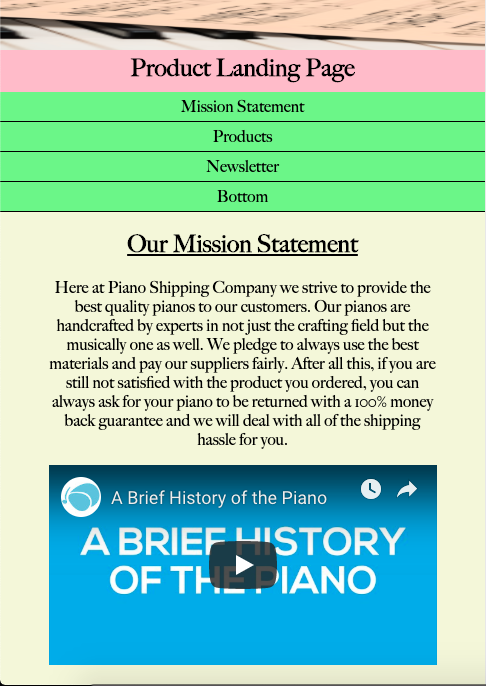
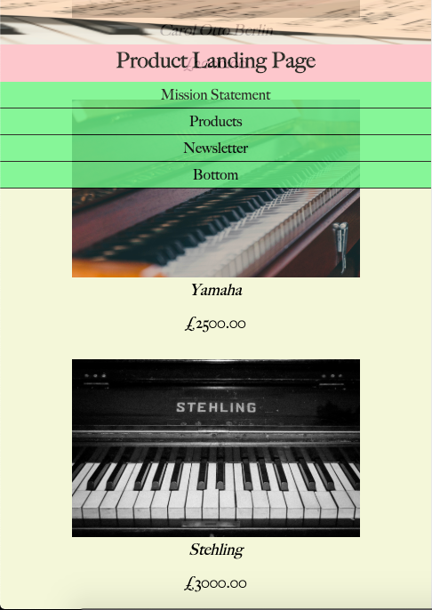
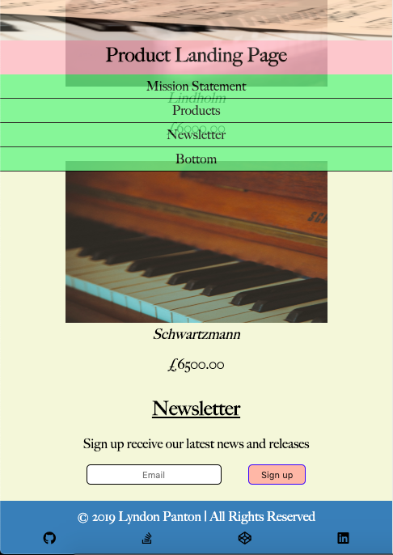
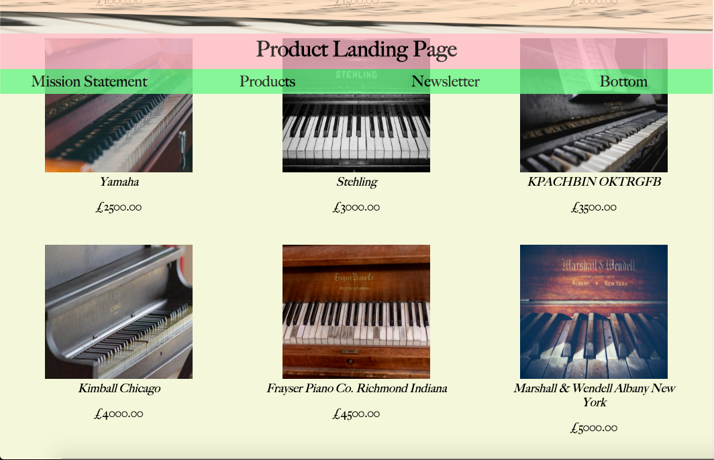
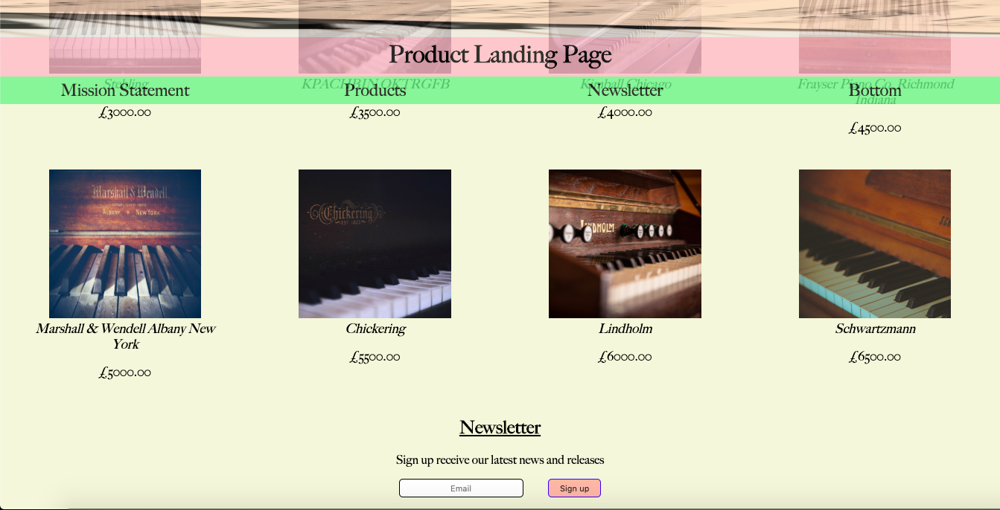
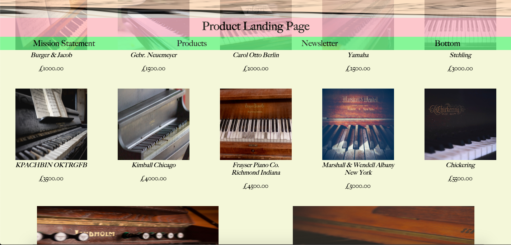

# Product Landing Page

## How To Open
> 1. Go to the project's download folder
> 2. Right click on the file named _index.html_
> 3. Choose the _open with_ option
> 4. Open the page in your desired browser

## How To Use
> 1. Use the top navigation items to view each section
> 2. The first section has an imaginary company's mission statement and a video about pianos
> 3. The second section has all the products being sold by the company
> 4. The third section has a small form for signing up to the company's newsletter

## Requirements
> 1. This project requires a browser to run

## Extra Information
> 1. This was done as one of the project's for _freecodecamp_'s responsive web design certificate

## Preview

